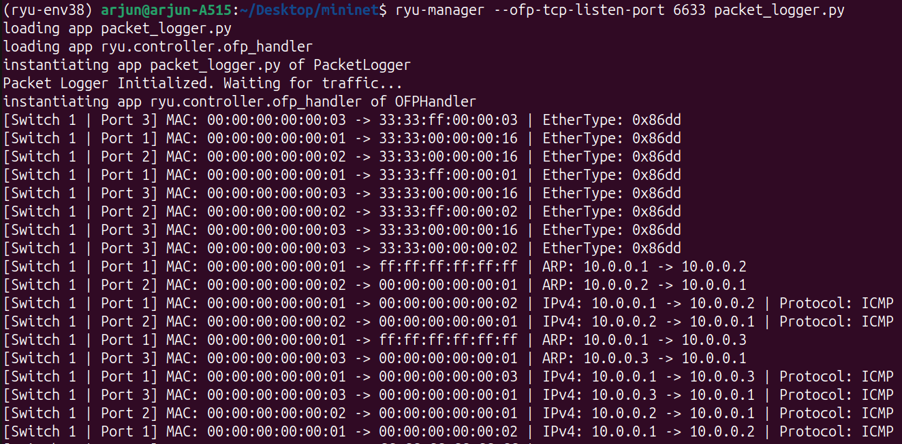
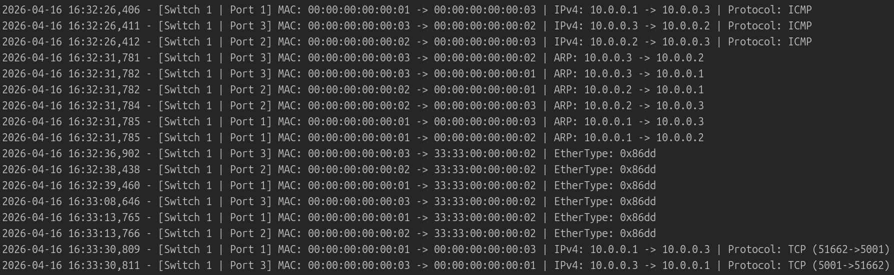
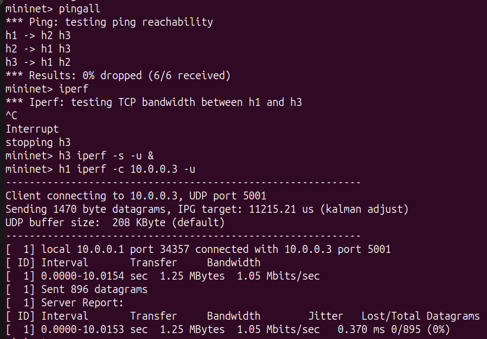
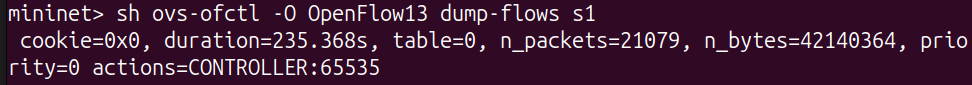
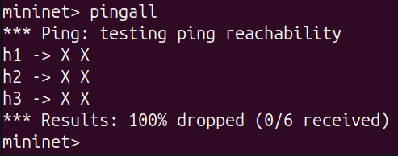

# SDN Packet Logger using Ryu and Mininet

## Problem Statement

This project implements an SDN-based packet logger using **Mininet** and the **Ryu OpenFlow controller**. The controller captures `PacketIn` events from an OpenFlow 1.3 switch, extracts packet headers, identifies common protocols, logs the packet details, and forwards traffic so the virtual network continues to function.

The project demonstrates:

* controller–switch interaction
* explicit OpenFlow flow rules
* `packet_in` event handling
* match + action behavior
* network behavior observation using Mininet and `iperf`

## Objective

The goal is to:

* capture packet headers traversing the network
* identify protocol types such as ARP, IPv4, ICMP, TCP, and UDP
* maintain logs in the controller terminal and in a log file
* display packet information in real time
* validate the behavior using ping, TCP throughput, and UDP traffic tests

## Topology

The demo uses a simple Mininet topology:

```text
h1 ---+
      |
      s1
      |
h2 ---+
      |
     h3
```

* **h1, h2, h3** are Mininet hosts
* **s1** is an Open vSwitch instance
* **Ryu** acts as the remote SDN controller

A small topology was chosen because it makes the controller behavior easy to observe during the demo and keeps the focus on packet logging, flow rules, and protocol identification.

## Flow Rule Design (Match–Action Logic)

The controller installs a table-miss flow rule that forwards unmatched packets
to the controller using:

actions=CONTROLLER:65535

This ensures PacketIn events are generated whenever the switch does not find
a matching forwarding rule. The controller then analyzes packet headers and
forwards packets using PacketOut flood action.

## Features Implemented

* OpenFlow 1.3 controller using Ryu
* explicit table-miss flow rule
* `PacketIn` handling
* MAC address logging
* ARP detection
* IPv4 detection
* ICMP detection
* TCP port logging
* UDP port logging
* packet forwarding using `PacketOut`
* persistent logging to `packet_log.txt`

## Requirements

* Ubuntu
* Mininet
* Open vSwitch
* Python 3.8 environment for Ryu
* Ryu controller

## File Structure

```text
SDN-Packet-Logger-Mininet-Ryu/
├── packet_logger.py
├── README.md
└── screenshots/
    ├── controller_packet_logs.png
    ├── packet_log_file_output.png
    ├── ping_and_iperf_results.png
    ├── flow_table_rules.png
    └── failure_scenario_ping_loss.png
```

## Setup

### 1. Activate the Python environment

```bash
source ~/Desktop/mininet/ryu-env38/bin/activate
```

### 2. Start the controller

Run this from the folder that contains `packet_logger.py`:

```bash
ryu-manager --ofp-tcp-listen-port 6633 packet_logger.py
```

### 3. Start Mininet

Open a second terminal and run:

```bash
sudo mn -c
sudo mn --topo single,3 --mac \
--switch ovs,protocols=OpenFlow13 \
--controller remote,ip=127.0.0.1,port=6633
```

## How the Controller Works

The controller installs a **table-miss flow rule** so that packets without a matching forwarding entry are sent to the controller. When a `PacketIn` event arrives:

1. The controller reads the Ethernet header.
2. It checks whether the packet contains ARP or IPv4.
3. If IPv4 is present, it checks the L4 protocol.
4. It logs the source and destination MAC/IP addresses.
5. It identifies ICMP, TCP, or UDP where applicable.
6. It writes the same information to `packet_log.txt`.
7. It sends a `PacketOut` with flood action so traffic continues moving.

This demonstrates both monitoring and forwarding behavior in an SDN environment.

## Test Scenarios

### Scenario 1: Normal Operation

Generate traffic while the controller is running.

#### ICMP test

```bash
pingall
```

#### TCP test

```bash
iperf
```

#### UDP test

```bash
h3 iperf -s -u &
h1 iperf -c 10.0.0.3 -u
```

Expected result:

* the controller logs ARP, ICMP, TCP, and UDP packets
* Mininet shows successful communication
* packet details appear in the terminal and in `packet_log.txt`

### Scenario 2: Failure / Validation Test

Stop the controller and run `pingall` again.

Expected result:

* packets are no longer handled by the controller
* connectivity fails
* Mininet shows packet loss

This validates controller dependency and demonstrates the failure scenario required for testing.

## Flow Table Evidence

The controller installs a default rule that sends unmatched packets to the controller. The flow table output should show a controller action for table-miss behavior.

Expected command:

```bash
sh ovs-ofctl -O OpenFlow13 dump-flows s1
```

## Expected Output

### Controller terminal

You should see logs similar to:

```text
[Switch 1 | Port 1] MAC: 00:00:00:00:00:01 -> 00:00:00:00:00:02 | ARP: 10.0.0.1 -> 10.0.0.2
[Switch 1 | Port 1] MAC: 00:00:00:00:00:01 -> 00:00:00:00:00:03 | IPv4: 10.0.0.1 -> 10.0.0.3 | Protocol: ICMP
[Switch 1 | Port 1] MAC: 00:00:00:00:00:01 -> 00:00:00:00:00:03 | IPv4: 10.0.0.1 -> 10.0.0.3 | Protocol: TCP (51662->5001)
[Switch 1 | Port 1] MAC: 00:00:00:00:00:01 -> 00:00:00:00:00:03 | IPv4: 10.0.0.1 -> 10.0.0.3 | Protocol: UDP (34357->5001)
```

### Mininet terminal

You should see:

* `pingall` results with `0% dropped` in the normal case
* `iperf` throughput output
* UDP client/server output
* `100% dropped` in the failure case when the controller is stopped

## Screenshots / Proof of Execution

### 1. Controller logs



### 2. Packet log file output



### 3. Ping and iperf results



### 4. Flow table rules



### 5. Failure scenario



## Performance Observation

Latency was measured using pingall, which showed 0% packet loss when the
controller was active.

Throughput was measured using iperf TCP and UDP tests, confirming successful
data transfer between hosts.

Flow-table inspection confirmed that packets were redirected to the controller
through the table-miss rule before forwarding decisions were applied.

## Result

The project successfully demonstrates an SDN packet logger that captures packet headers, identifies protocol types, maintains logs, and shows observable network behavior using Mininet and the Ryu controller.
